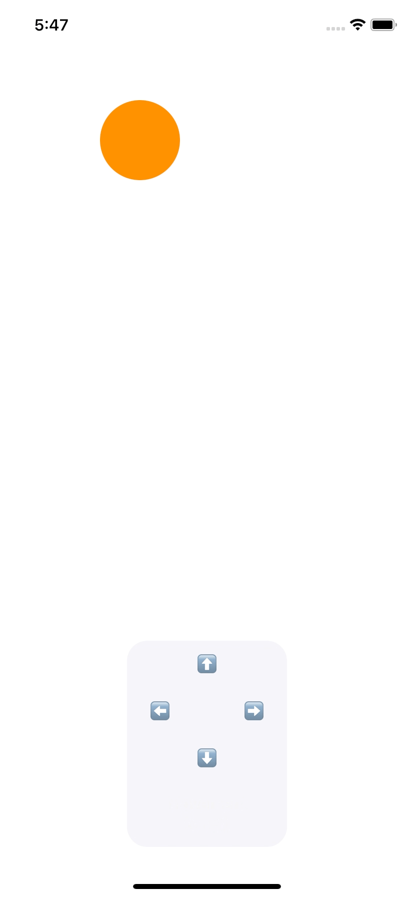

#  CircleMovementGame
**Mini game – moving the circle on the screen.**  
Task: the circle does not touch the borders of the screen and the joystick with buttons, an error message is displayed in the label, appears when the circle cannot be moved, the direction of movement is displayed in the label when the circle is moved.

[Code](https://github.com/murzha/TeachMeSkills-learning/tree/main/HW-7-Structuring-code-Access-modifiers)  
